<h2>TensorFlow-FlexUNet-Image-Segmentation-Multi-Organ-Gynaecological-MRI (2026/09/21)</h2>
Sarah T. Arai 
Software Laboratory antillia.com  
This is the first experiment in Image Segmentation for 
<b>Multi-Organ Gynaecological Magnetic Resonance Imaging for Brachytherapy-based Oncology
 (MOGaMBO)</b> 
based on our 
<a href="https://github.com/sarah-antillia/TensorFlow-FlexUNet-Image-Segmentation-Model"><b>TensorFlowFlexUNet Model</b></a> 
(TensorFlow Flexible UNet Image Segmentation Model for Multiclass), 
and a 512x512-pixel PNG 
<a href="https://drive.google.com/file/d/1-120uctQ3n5cPsBOxWsRiWeW5FMMnLGR/view?usp=sharing">
<b>MOGaMBO-ImageMask-Dataset.zip</b></a> with colorized masks 
(<a href="<a href="https://creativecommons.org/licenses/by/4.0/">CC BY 4.0</a>), 
which was derived by us from the Zenodo website  
<a href="https://zenodo.org/records/15156638">
<b>Multi-Organ Gynaecological Magnetic Resonance Imaging for Brachytherapy-based Oncology</b>
</a>
  

<b>Actual Image Segmentation for MOGaMBO Images </b> 
As shown below, the inferred masks predicted by our segmentation model trained on the dataset appear similar 
to the ground truth masks except for the second case.  
<table >
<tr>
<th>Input: image</th>
<th>Mask (ground_truth)</th>
<th>Prediction: inferred_mask</th>
</tr>
<tr>
<td>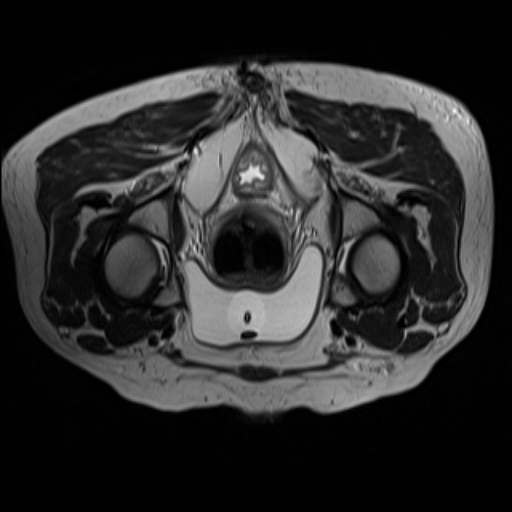</td>
<td></td>
<td></td>
</tr>
<tr>
<td>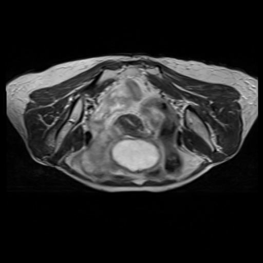</td>
<td></td>
<td>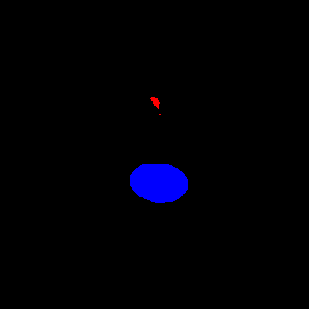</td>
</tr>
<tr>
<td>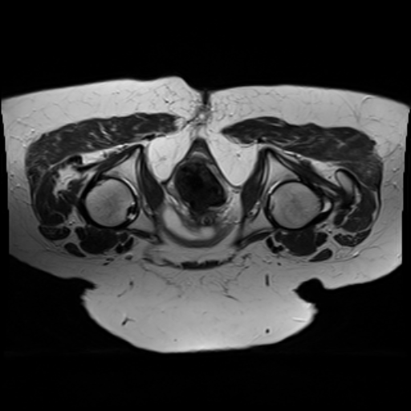</td>
<td></td>
<td></td>
</tr>
</table>

We used the following class_color_mapping table to generate our PNG dataset from the orginal NIfTI dataset.  
<b>class_color_mapping_table</b>  
<table border=1 style='border-collapse:collapse;' cellpadding='5'>
<tr><th>Indexed Color</th><th>Color</th><th>RGB</th><th>Class</th></tr>
<tr><td>1</td><td with='80' height='auto'></td>
<td>(255, 0, 0)</td><td>Bladder</td></tr>
<tr><td>2</td><td width='80' height='auto'></td>
<td>(0, 255, 0)</td><td>Rectum</td></tr>
<tr><td>3</td><td with='80' height='auto'></td>
<td>(0, 0, 255)</td><td>Sigmoid Colon</td></tr>
<tr><td>4</td><td width='80' height='auto'></td>
<td>(255, 255, 0)</td><td>Femoral Heads</td></tr>
</table>
 
<h3>1.  Dataset Citation</h3>
The dataset used here was derived from   
<a href="https://zenodo.org/records/15156638">
<b>Multi-Organ Gynaecological Magnetic Resonance Imaging for Brachytherapy-based Oncology</b>
</a>
  
Das, Suresh (Annotator), Manna, Siladittya (Researcher), Ghosh, Sayantari (Supervisor) 
Bhattacharya, Saumik (Supervisor)
  
The following explanation (excerpt) was taken from the website above.  
<b>Description</b> 
This dataset introduces a <b>Multi-Organ Gynaecological Magnetic Resonance Imaging for Brachytherapy-based Oncology
 (MOGaMBO)</b> dataset, a novel magnetic resonance imaging dataset aimed at advancing research in applications of 
 computational intelligence in brachytherapy diagnosis and organ segmentation for cervical cancer treatment.  
 The dataset comprises high-resolution T2-weighted 3D MR scans from 94 patients with locally advanced cervical cancer 
 (stages IB2–IVA), adhering to FIGO guidelines for interstitial and intra-cavitary brachytherapy.  
 The imaging was performed using a 1.5T GE Signa Explorer scanner, with acquisition parameters TR and TE set to 
 optimal values for soft-tissue contrast at 2600ms and 155ms, respectively, combined with a pixel 
 resolution of 0.5 × 0.5 mm² and 30–50 slices per scan. To ensure dosimetric consistency, bladder volume 
 was standardized via Foley catheterization during imaging.   
The <b>critical organs-at-risk—urinary</b>  
<b>bladder</b>,  
<b>rectum</b>,  
<b>sigmoid colon</b>, and 
<b>femoral heads</b>,  
were manually contoured by expert radiation oncologists using the open-source ITK-SNAP platform, 
 ensuring precise region-of-interest annotations.  
 The dataset underwent rigorous deidentification to protect patient privacy, removing all demographic 
 and identifiable information. MOGaMBO provides a standardized, privacy-compliant resource for developing 
 and validating medical image segmentation or representation learning algorithms, and brachytherapy-related 
 research tools. This dataset addresses a critical gap in accessible, multi-organ imaging resources for 
 the gynaecological brachytherapy dataset, with applications in treatment planning and AI-driven clinical research.
  
<b>Citation</b> 
BibTex: 
<pre>
@misc{manna2025,
      title={Federated Self-Supervised Learning for One-Shot Cross-Modal and Cross-Imaging Technique Segmentation}, 
      author={Siladittya Manna and Suresh Das and Sayantari Ghosh and Saumik Bhattacharya},
      year={2025},
      eprint={2503.23507},
      archivePrefix={arXiv},
      primaryClass={cs.CV},
      url={https://arxiv.org/abs/2503.23507}, 
}
</pre>
 
<b>License</b> 
<a href="https://creativecommons.org/licenses/by/4.0/">Creative Commons Attribution 4.0 International</a>
  

<h3>
2. MOGaMBO ImageMask Dataset
</h3>
 If you would like to train this MOGaMBO Segmentation model,
please down load our dataset <a href="https://drive.google.com/file/d/1-120uctQ3n5cPsBOxWsRiWeW5FMMnLGR/view?usp=sharing">
<b>MOGaMBO-ImageMask-Dataset.zip</b> (<a href="<a href="https://creativecommons.org/licenses/by/4.0/">CC BY 4.0</a>)
</a> on Google Drive.
Expand the downloaded and put it under <b>./dataset/</b> to be:
<pre>
./dataset
└─MOGaMBO
    ├─test
    │   ├─images
    │   └─masks
    ├─train
    │   ├─images
    │   └─masks
    └─valid
         ├─images
         └─masks
</pre>
 
<b>MOGaMBO Statistics</b> 
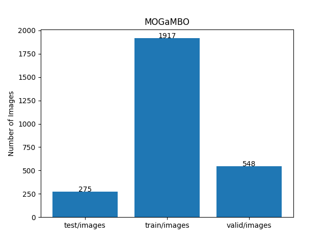 
 
As shown above, the number of images of train and valid datasets is large enough to use as the training set for our segmentation model.
  
<b>Train_sample images</b> 
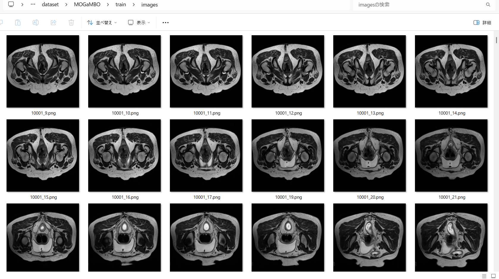
 
<b>Train_sample masks</b> 
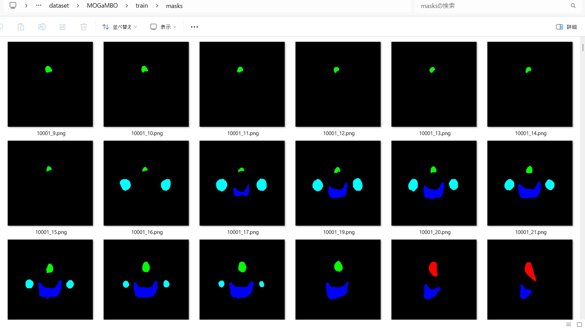
 
<h3>
3. Train TensorFlowFlexUNet Model
</h3>
 We trained the MOGaMBO TensorFlowFlexUNet Model by using the 
<a href="./projects/TensorFlowFlexUNet/MOGaMBO/train_eval_infer.config"> <b>train_eval_infer.config</b></a> file.  
Please move to the <b>./projects/TensorFlowFlexUNet/MOGaMBO</b> folder and run the following bat file. 
<pre>
>1.train.bat
</pre>
This simply runs the following command. 
<pre>
>python ../../../src/TensorFlowFlexUNetTrainer.py ./train_eval_infer.config
</pre>

<b>Model parameters</b> 
Defined a small <b>base_filters=16</b> and a large <b>base_kernels=(11,11)</b> for the first Conv Layer of Encoder Block of 
<a href="./src/TensorFlowFlexUNet.py">TensorFlowFlexUNet.py</a> 
and a large <b>num_layers=8</b> (including a bridge between Encoder and Decoder Blocks).
<pre>
[model]
image_width    = 512
image_height   = 512
image_channels = 3
input_normalize = True
normalization  = False
num_classes    = 5
base_filters   = 16
base_kernels  = (11,11)
num_layers    = 8
dropout_rate   = 0.05
dilation       = (1,1)
</pre>
<b>Learning rate</b> 
Defined a small learning rate.  
<pre>
[model]
learning_rate  = 0.00007
</pre>
<b>Loss and metrics functions</b> 
Specified "categorical_crossentropy" and "dice_coef_multiclass". 
<pre>
[model]
loss           = "categorical_crossentropy"
metrics        = ["dice_coef_multiclass"]
</pre>
<b >Learning rate reducer callback</b> 
Enabled the learning_rate_reducer callback and a small reducer_patience.
<pre> 
[train]
learning_rate_reducer = True
reducer_factor     = 0.4
reducer_patience   = 4
</pre>
<b>Early stopping callback</b> 
Enabled early stopping callback with the patience parameter.
<pre>
[train]
patience      = 10
</pre>
<b></b> 
<b>RGB color map</b> 
RGB color map dict for MOGaMBO 1+8 classes. 
<pre>
mask_datatyoe    = "categorized"
mask_file_format = ".png"
;MOGaMBO 1+4
; Bladder: blue
; Rectum:  green
; Sigmoid colon: red  
; Femoral heads: cyan
rgb_map= {(0,0,0):0,(0,0,255):1,(0,255,0):2,(255,0,0):3,(0,255,255):4}
</pre>
<b>Epoch change inference callbacks</b> 
Enabled epoch_change_infer callback. 
<pre>
[train]
epoch_change_infer     = True
epoch_change_infer_dir =  "./epoch_change_infer"
epoch_change_tiled_infer     = False
epoch_change_tiled_infer_dir =  "./epoch_change_tiled_infer"
</pre>
By using this epoch_change_infer callback, on every epoch change, the inference procedure can be called
 for 6 images in <b>mini_test</b> folder. This will help you confirm how the predicted mask changes 
 at each epoch during your training process.    
<b>Epoch_change_inference output at starting (1,2,3)</b> 
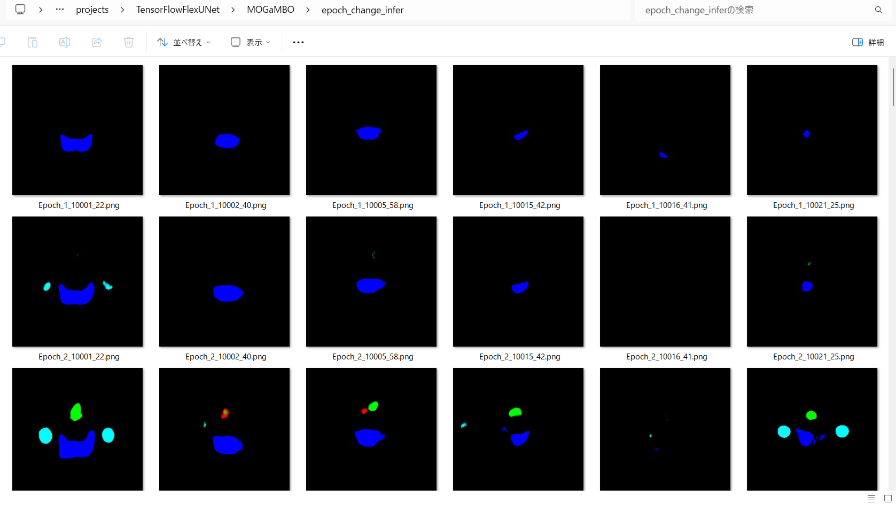 
 
<b>Epoch_change_inference output at middlepoint (14,15,16)</b> 
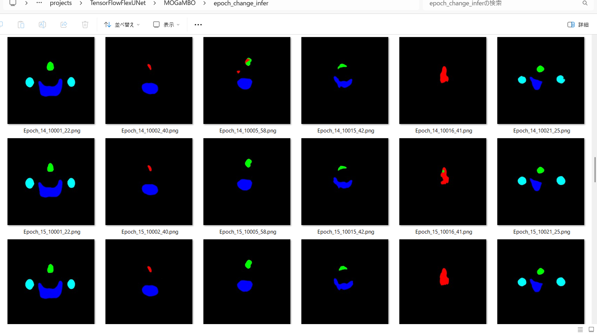 
 
<b>Epoch_change_inference output at ending (29,30,31)</b> 
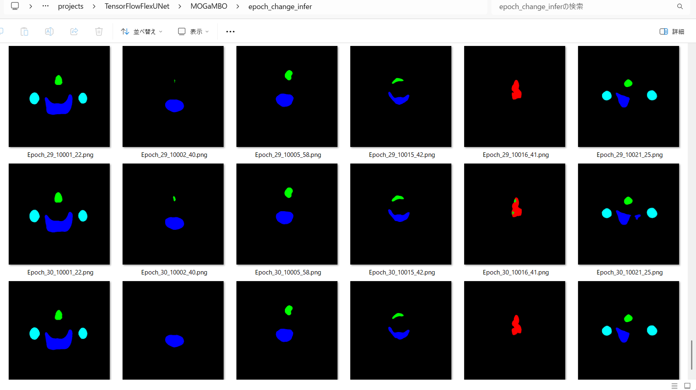 

 
In this experiment, the training process was stopped at epoch 31 by EarlyStoppingCallback.  
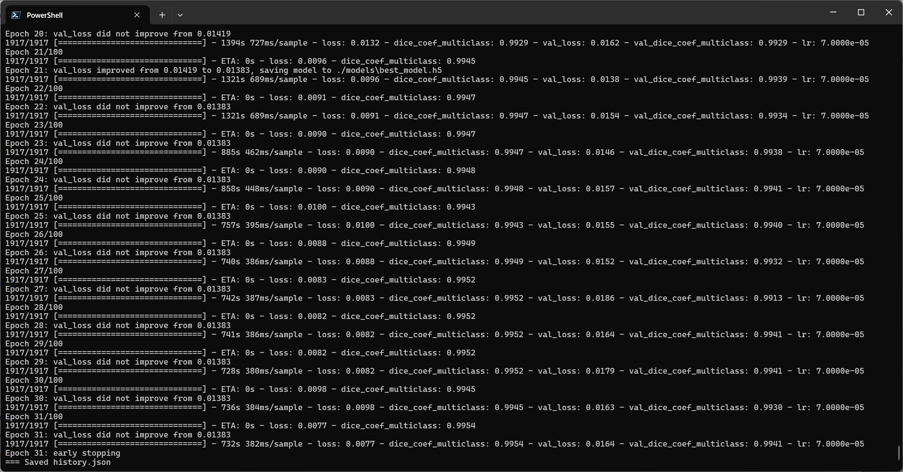 
 
<a href="./projects/TensorFlowFlexUNet/MOGaMBO/eval/train_metrics.csv">train_metrics.csv</a> 
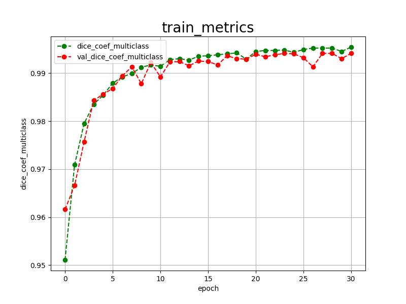 

 
<a href="./projects/TensorFlowFlexUNet/MOGaMBO/eval/train_losses.csv">train_losses.csv</a> 
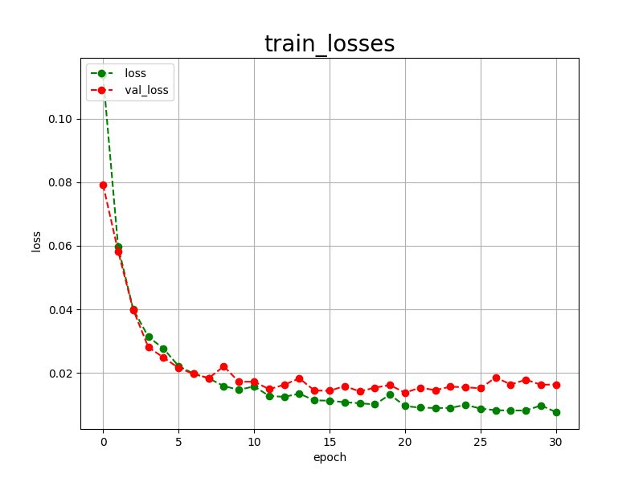 
 
<h3>4. Evaluation</h3>
Please move to  <b>./projects/TensorFlowFlexUNet/MOGaMBO</b> folder, 
and run the following bat file to evaluate the TensorFlowFlexUNet model for MOGaMBO. 
<pre>
>./2.evaluate.bat
</pre>
This simply runs the following command.
<pre>
>python ../../../src/TensorFlowFlexUNetEvaluator.py  ./train_eval_infer.config
</pre>
Evaluation console output: 
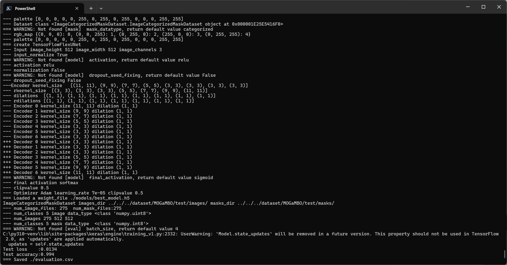
  Image-Segmentation-MOGaMBO

<a href="./projects/TensorFlowFlexUNet/MOGaMBO/evaluation.csv">evaluation.csv</a> 
The loss (categorical_crossentropy) to the  <b>MOGaMBO/test</b> was low, and dice_coef_multiclass was
high, as shown below.
 
<pre>
categorical_crossentropy,0.0134
dice_coef_multiclass,0.994
</pre>
 
<h3>5. Inference</h3>
Please move to the <b>./projects/TensorFlowFlexUNet/MOGaMBO</b> folder and run the following bat file to infer segmentation regions for images using the trained TensorFlowFlexUNet model for MOGaMBO. 
<pre>
>./3.infer.bat
</pre>
This simply runs the following command.
<pre>
>python ../../../src/TensorFlowFlexUNetInferencer.py ./train_eval_infer.config
</pre>

<b>mini_test_images</b> 
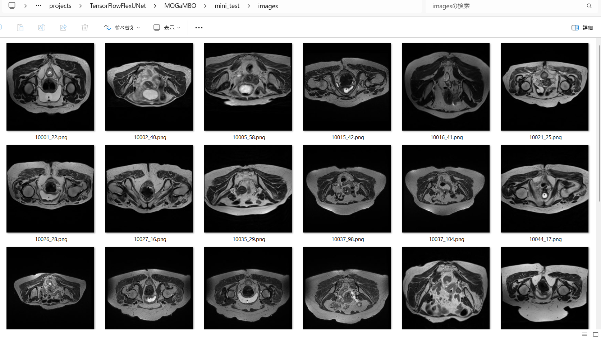 
<b>mini_test_mask(ground_truth)</b> 
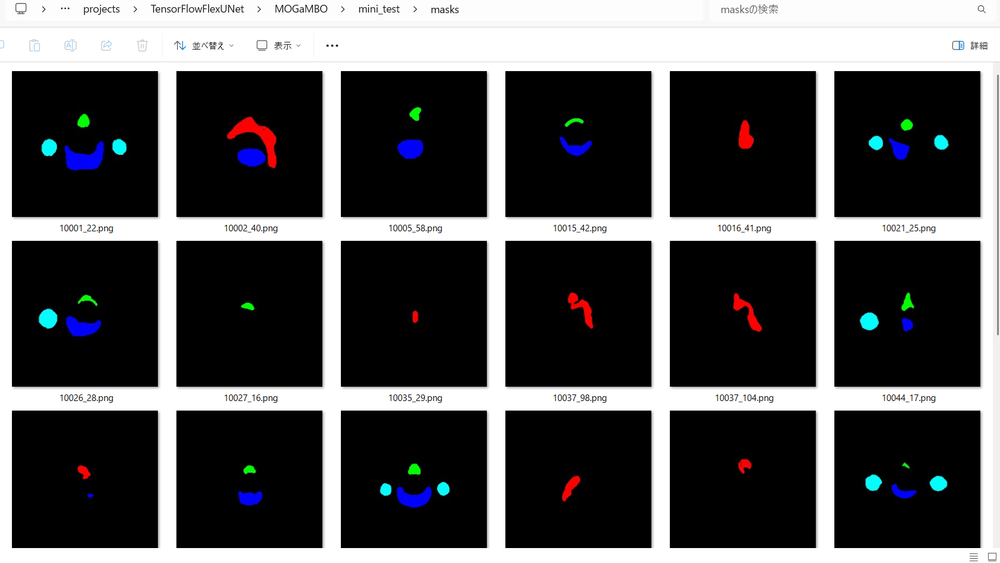 

<b>Inferred test masks</b> 
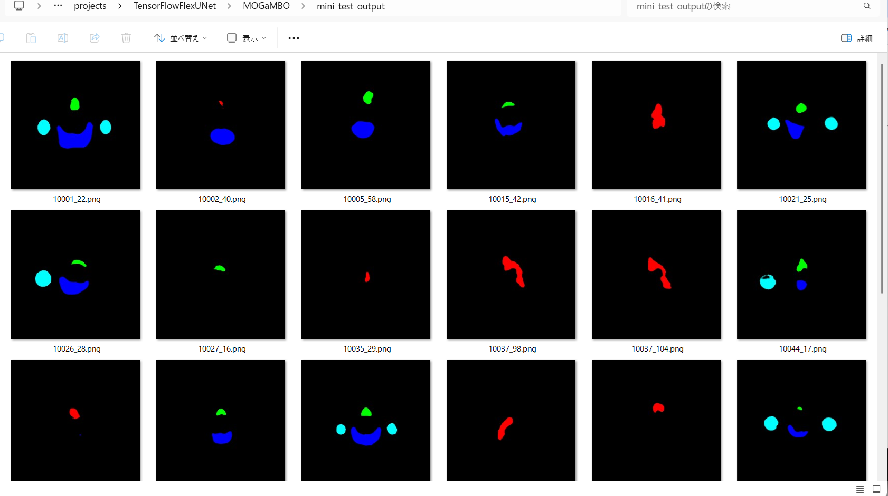 
 

<b>Enlarged images and masks for MOGaMBO  Images </b> 
As shown below, the inferred masks predicted by our segmentation model trained on the dataset appear similar 
to the ground truth masks.
  
<table>
<tr>
<th>Input: image</th>
<th>Mask (ground_truth)</th>
<th>Prediction: inferred_mask</th>
</tr>
<tr>
<td>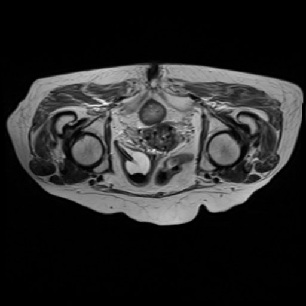</td>
<td></td>
<td></td>
</tr>
<tr>
<td>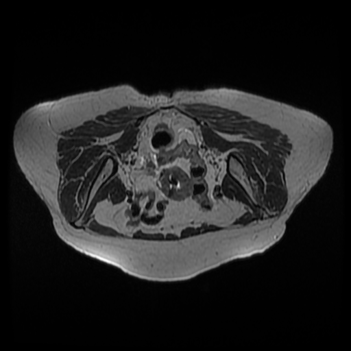</td>
<td></td>
<td>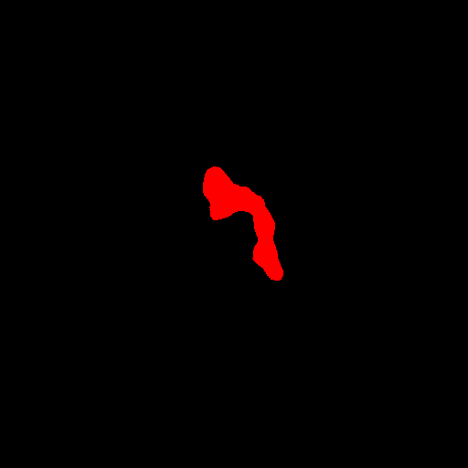</td>
</tr>
<tr>
<td>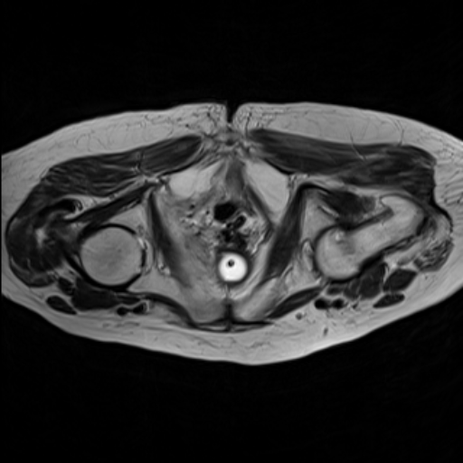</td>
<td></td>
<td>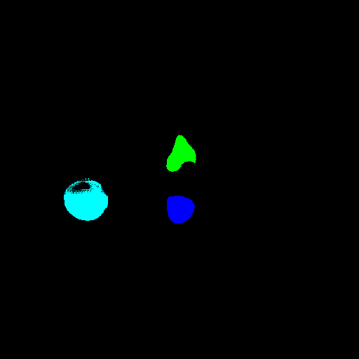</td>
</tr>
<tr>
<td>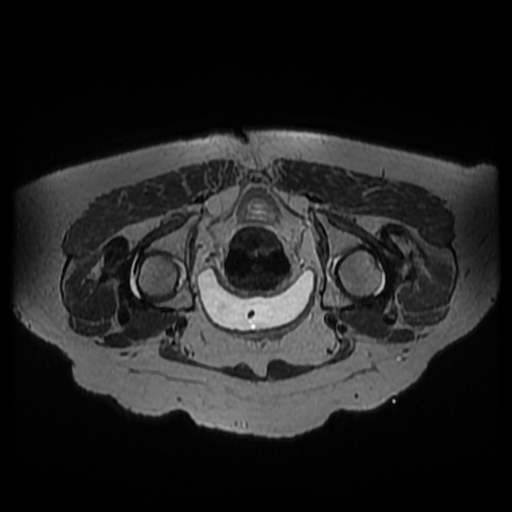</td>
<td></td>
<td></td>
</tr>
<tr>
<td>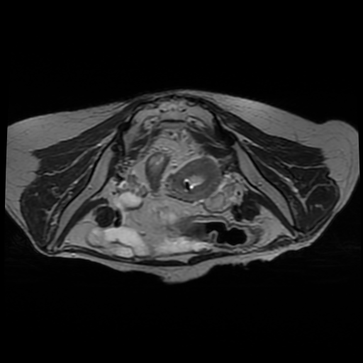</td>
<td>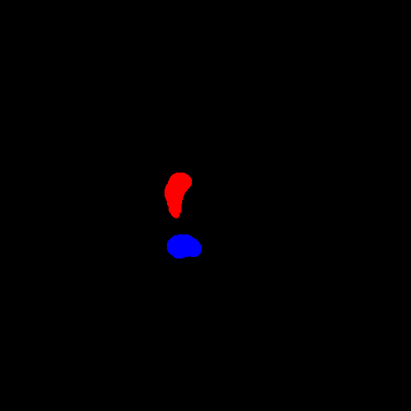</td>
<td>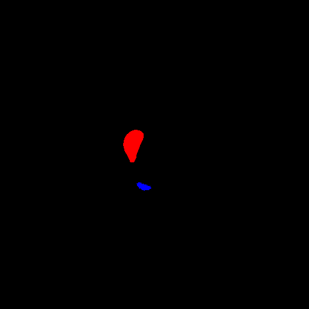</td>
</tr>
<tr>
<td>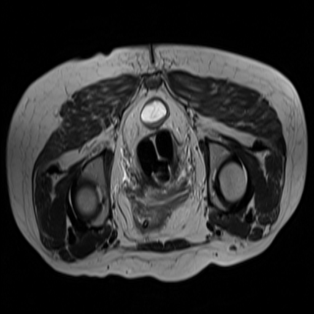</td>
<td></td>
<td>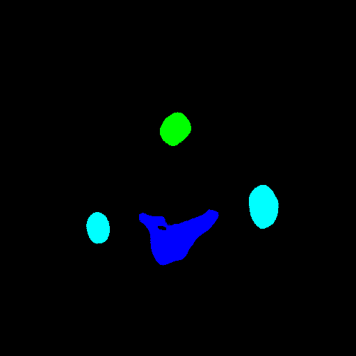</td>
</tr>
</table>

 
<h3>
References
</h3>
<b>1. Bridging the gap toward automated analysis of female pelvic MRI</b> 
Elodie Germani, Krystel Nyangoh-Timoh, John SH Baxter, Pierre Jannin 
<a href="https://hal.science/hal-05534766v1/file/abstract-iabm-egermani.pdf">
https://hal.science/hal-05534766v1/file/abstract-iabm-egermani.pdf
</a>
  
<b>2. TensorFlow-FlexUNet-Image-Segmentation-Model</b> 
Toshiyuki Arai  
<a href="https://github.com/sarah-antillia/TensorFlow-FlexUNet-Image-Segmentation-Model">
https://github.com/sarah-antillia/TensorFlow-FlexUNet-Image-Segmentation-Model
</a>
 
 
